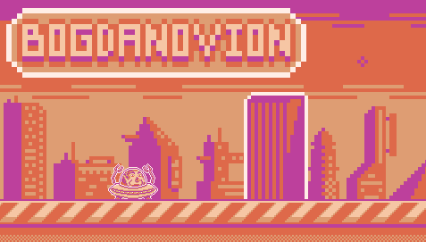
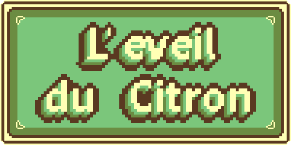
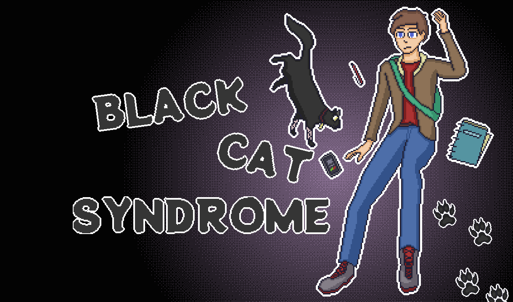

## Bogdanovion
### [Lien Direct](https://alexanderamarok.itch.io/bogdanovion)

Aide Bogdanovion a s'echapper de la Metropole !
Un jeu shitpost clone de Flappy Bird.
U just got Bogded.

## L'eveil du citron
### [Lien Direct](https://alexanderamarok.itch.io/bogdanovion)

Un jeu pour la Mine de Talent de Globtopus sur les mots Citron / Balle / Clé.
Jouez Lemonman, et sauvez Globtopia des tyrans !

Un jeu réalisé en une semaine, sur un logiciel qui m'a couté 80 balles, tout ça pour un jeu avec un fucking citron quand même.

## Black Cat Syndrome
### [Lien Direct](https://alexanderamarok.itch.io/black-cat-syndrome)

Travail de fin d'études.

C'est un visual novel assez basique sur l'anxiété. C'est un peu edgy et pas très bien écrit, mais faut bien commencer quelque part. Mais l'histoire (et certains dialogues) sont basés sur des situations réelles que j'ai vécu avec mes camarades étudiants, durant nos 3 années en prison de cours à l'école.